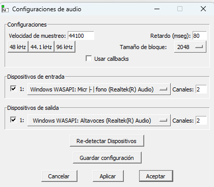

# 🎛️ DJ System - Pure Data OSC Controller

## 👥 Team Members

- Juan Esteban Becerra Gutiérrez
- Alejandro Sarmiento Rivera

## 🎥 Video link

https://youtu.be/H2ICc9ev07c

## 📝 Description

This project implements an interactive DJ system using **Pure Data** and **OSC (Open Sound Control)**. The system receives OSC messages from a mobile app (OSC Controller) and generates real-time electronic music by processing different audio signals controlled through sliders, toggles, and buttons.

## 🎯 Why this approach?

Our DJ system was designed with a specific aesthetic and functional vision in mind. We chose to focus on creating a synthwave-inspired template for several reasons:

1. **Retro-futuristic Appeal**: Synthwave's distinctive sound perfectly combines nostalgic 80s elements with modern electronic music production techniques.

2. **User Experience**: By incorporating meme sounds alongside traditional DJ elements.

## 📚 Libraries Used

This project requires the following Pure Data libraries:

- OSC

## ⚙️ Setup Instructions

### 1. Initial Setup

1. Download `dj_system.pd`
2. Install the OSC Controller app (available through Apptoide or alternative sources)
   > ⚠️ Note: Please download from trusted sources only

### 2. Connection Configuration

1. Open Command Prompt and type `ipconfig` to find your IP address
2. Enter your device's IP address in the app
3. Set the port to `8000`

### 3. Audio Settings

1. Navigate to media -> audio settings
2. Configure the following for optimal audio quality:
   - Sample rate: 44100 kHz
   - Block size: 2048

## 🎮 Controls Layout

### Page 1: Main Controls

- Slider1: Volume
- Slider2: Low pass filter
- Slider3: High pass filter
- Slider4: Bass pass filter

- Toggles 1 - 3: Rithms

- Buttons 1 - 3: Drums sounds

### Page 2: Voice Modulation

2D slider to modulate voice via oscilator and low pass filter

### Page 3: Synth notes

- gridToggle1: Activate microphone for the voice modulator in page 2

- gridToggles 2 - 24: Synth notes

### Page 4: Sounds and more synth notes

- gridButtons 1 - 4: Meme sounds filtered

- gridButtons 5 - 24: More synth sounds

## 📜 License

This project is for educational purposes as part of the Interactive Systems course.
